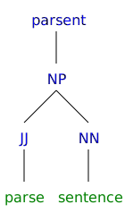

```{r, echo=FALSE}
desc <- suppressWarnings(readLines("DESCRIPTION"))
regex <- "(^Version:\\s+)(\\d+\\.\\d+\\.\\d+)"
loc <- grep(regex, desc)
ver <- gsub(regex, "\\2", desc[loc])
verbadge <- sprintf('<a href="https://img.shields.io/badge/Version-%s-orange.svg"></a></p>', ver, ver)
````

[](https://travis-ci.org/trinker/parsent)
[](https://coveralls.io/r/trinker/parsent?branch=master)
`r verbadge`

```{r, echo=FALSE, message=FALSE}
library(knitr)
knit_hooks$set(htmlcap = function(before, options, envir) {
  if(!before) {
    paste('<p class="caption"><b><em>',options$htmlcap,"</em></b></p>",sep="")
    }
    })
knitr::opts_knit$set(self.contained = TRUE, cache = FALSE)
knitr::opts_chunk$set(fig.path = "inst/figure/")
```

  

**parsent** is a collection of tools used to parse sentences.  The package is a wrapper for the **NLP**/**openNLP** packages that simplifies and extends the user experience.

# Installation

To download the development version of **parsent**:

Download the [zip ball](https://github.com/trinker/parsent/zipball/master) or [tar ball](https://github.com/trinker/parsent/tarball/master), decompress and run `R CMD INSTALL` on it, or use the **pacman** package to install the development version:

```r
if (!require("pacman")) install.packages("pacman")
pacman::p_load_gh("trinker/parsent")
```

# Contact

You are welcome to:
* submit suggestions and bug-reports at: <https://github.com/trinker/parsent/issues>
* send a pull request on: <https://github.com/trinker/parsent/>
* compose a friendly e-mail to: <tyler.rinker@gmail.com>

# Demonstration

## Load the Packages/Data

```{r, message=FALSE}
if (!require("pacman")) install.packages("pacman")

pacman::p_load(parsent, magrittr)

txt <- c(
    "Really, I like chocolate because it is good. It smells great.",
    "Robots are rather evil and most are devoid of decency.",
    "He is my friend.",
    "Clifford the big red dog ate my lunch.",
    "Professor Johns can not teach",
    "",
    NA
)
```

## Create Annotator 

```{r}
if(!exists('parse_ann')) {
    parse_ann <- parse_annotator()
}
```

## Parsing
```{r}
(x <- parser(txt, parse_ann))
```

## Plotting
```{r}
plot(x[[2]])
```

```{r}
par(
    mfrow = c(3, 2),
    mar = c(0,0,1,1) + 0.1
)
invisible(lapply(x[1:5], plot))
```

## Get Subject, Verb, and Direct Object
### Subject

```{r}
get_phrase_type(x, "NP") %>%
    take() %>%
    get_leaves()
```


### Predicate Verb
```{r}
get_phrase_type_regex(x, "VP") %>%
    take() %>%
    get_phrase_type_regex("(VB|MD)") %>%
    take() %>%
    get_leaves()
```

### Direct Object
```{r}
get_phrase_type_regex(x, "VP") %>%
    take() %>%
    get_phrase_type_regex("NP") %>%
    take() %>%
    get_leaves()
```
