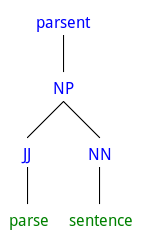
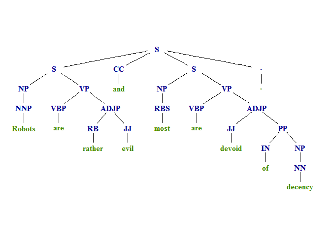

parsent
============

**parsent** is a collection of tools used to parse sentences. The
package is a wrapper for the **NLP**/**openNLP** packages that
simplifies and extends the user experience.

Function Usage
==============

Functions typically fall into the task category of (1) parsing, (2)
converting, & (3) extracting. The main functions, task category, &
descriptions are summarized in the table below:

<table>
<thead>
<tr class="header">
<th align="left">Function</th>
<th align="left">Task</th>
<th align="left">Description</th>
</tr>
</thead>
<tbody>
<tr class="odd">
<td align="left"><code>parser</code></td>
<td align="left">parsing</td>
<td align="left">Parse sentences into phrases</td>
</tr>
<tr class="even">
<td align="left"><code>parse_annotator</code></td>
<td align="left">parsing</td>
<td align="left">Generate <strong>OpenNLP</strong> parser required by <code>parser</code> function</td>
</tr>
<tr class="odd">
<td align="left"><code>as_tree</code></td>
<td align="left">converting</td>
<td align="left">Convert <code>parser</code> output into tree form</td>
</tr>
<tr class="even">
<td align="left"><code>as_square_brace</code></td>
<td align="left">converting</td>
<td align="left">Convert <code>parser</code> output in square brace form (vs. round)</td>
</tr>
<tr class="odd">
<td align="left"><code>as_square_brace_latex</code></td>
<td align="left">converting</td>
<td align="left">Convert <code>parser</code> output LaTeX ready form</td>
</tr>
<tr class="even">
<td align="left"><code>get_phrases</code></td>
<td align="left">extracting</td>
<td align="left">Extract <a href="https://en.wikipedia.org/wiki/Phrase_structure_grammar">phrases</a> from <code>parser</code> output</td>
</tr>
<tr class="odd">
<td align="left"><code>get_phrase_type</code></td>
<td align="left">extracting<code>| Extract phrases one step down the tree                    | |</code>get_phrase_type_regex<code>| extracting | Extract phrases at any level in the tree (uses regex)     | |</code>get_leaves<code>| extracting | Extract the leaves (tokens or words) from a phrase        | |</code>take`</td>
<td align="left">extracting</td>
</tr>
</tbody>
</table>

Table of Contents
============

-   [Function Usage](#function-usage)
-   [Installation](#installation)
-   [Contact](#contact)
-   [Demonstration](#demonstration)
    -   [Load the Packages/Data](#load-the-packagesdata)
    -   [Create Annotator](#create-annotator)
    -   [Parsing](#parsing)
    -   [Plotting](#plotting)
    -   [Get Subject, Verb, and Direct Object](#get-subject-verb-and-direct-object)
        -   [Subject](#subject)
        -   [Predicate Verb](#predicate-verb)
        -   [Direct Object](#direct-object)

Installation
============

To download the development version of **parsent**:

Download the [zip
ball](https://github.com/trinker/parsent/zipball/master) or [tar
ball](https://github.com/trinker/parsent/tarball/master), decompress and
run `R CMD INSTALL` on it, or use the **pacman** package to install the
development version:

    if (!require("pacman")) install.packages("pacman")
    pacman::p_load_gh("trinker/parsent")

Contact
=======

You are welcome to: 
* submit suggestions and bug-reports at: <https://github.com/trinker/parsent/issues> 
* send a pull request on: <https://github.com/trinker/parsent/> 
* compose a friendly e-mail to: <tyler.rinker@gmail.com>

Demonstration
=============

Load the Packages/Data
----------------------

    if (!require("pacman")) install.packages("pacman")

    pacman::p_load(parsent, magrittr)

    txt <- c(
        "Really, I like chocolate because it is good. It smells great.",
        "Robots are rather evil and most are devoid of decency.",
        "He is my friend.",
        "Clifford the big red dog ate my lunch.",
        "Professor Johns can not teach",
        "",
        NA
    )

Create Annotator
----------------

    if(!exists('parse_ann')) {
        parse_ann <- parse_annotator()
    }

Parsing
-------

    (x <- parser(txt, parse_ann))

    ## [[1]]
    ## [1] "(TOP (S (S (ADVP (RB Really))(, ,) (NP (PRP I)) (VP (VBP like) (NP (NN chocolate)) (SBAR (IN because) (S (NP (PRP it)) (VP (VBZ is) (ADJP (JJ good)))))))(. .) (NP (PRP It)) (VP (VBZ smells) (ADJP (JJ great)))(. .)))"
    ## 
    ## [[2]]
    ## [1] "(TOP (S (S (NP (NNP Robots)) (VP (VBP are) (ADJP (RB rather) (JJ evil)))) (CC and) (S (NP (RBS most)) (VP (VBP are) (ADJP (JJ devoid) (PP (IN of) (NP (NN decency))))))(. .)))"
    ## 
    ## [[3]]
    ## [1] "(TOP (S (NP (PRP He)) (VP (VBZ is) (NP (PRP$ my) (NN friend)))(. .)))"
    ## 
    ## [[4]]
    ## [1] "(TOP (S (NP (NNP Clifford)) (NP (DT the) (JJ big) (JJ red) (NN dog)) (VP (VBD ate) (NP (PRP$ my) (NN lunch)))(. .)))"
    ## 
    ## [[5]]
    ## [1] "(TOP (S (S (NP (NNP Professor) (NNP Johns)) (VP (MD can))) (RB not) (VB teach)))"
    ## 
    ## [[6]]
    ## [1] NA
    ## 
    ## [[7]]
    ## [1] NA

Plotting
--------

    plot(x[[2]])

    par(
        mfrow = c(3, 2),
        mar = c(0,0,1,1) + 0.1
    )
    invisible(lapply(x[1:5], plot))

Get Subject, Verb, and Direct Object
------------------------------------

### Subject

    get_phrase_type(x, "NP") %>%
        take() %>%
        get_leaves()

    ## [[1]]
    ## [1] "I"
    ## 
    ## [[2]]
    ## [1] "Robots"
    ## 
    ## [[3]]
    ## [1] "He"
    ## 
    ## [[4]]
    ## [1] "Clifford"
    ## 
    ## [[5]]
    ## [1] "Professor" "Johns"    
    ## 
    ## [[6]]
    ## [1] NA
    ## 
    ## [[7]]
    ## [1] NA

### Predicate Verb

    get_phrase_type_regex(x, "VP") %>%
        take() %>%
        get_phrase_type_regex("(VB|MD)") %>%
        take() %>%
        get_leaves()

    ## [[1]]
    ## [1] "like"
    ## 
    ## [[2]]
    ## [1] "are"
    ## 
    ## [[3]]
    ## [1] "is"
    ## 
    ## [[4]]
    ## [1] "ate"
    ## 
    ## [[5]]
    ## [1] "can"
    ## 
    ## [[6]]
    ## [1] NA
    ## 
    ## [[7]]
    ## [1] NA

### Direct Object

    get_phrase_type_regex(x, "VP") %>%
        take() %>%
        get_phrase_type_regex("NP") %>%
        take() %>%
        get_leaves()

    ## [[1]]
    ## [1] "chocolate"
    ## 
    ## [[2]]
    ## NULL
    ## 
    ## [[3]]
    ## [1] "my"     "friend"
    ## 
    ## [[4]]
    ## [1] "my"    "lunch"
    ## 
    ## [[5]]
    ## NULL
    ## 
    ## [[6]]
    ## [1] NA
    ## 
    ## [[7]]
    ## [1] NA